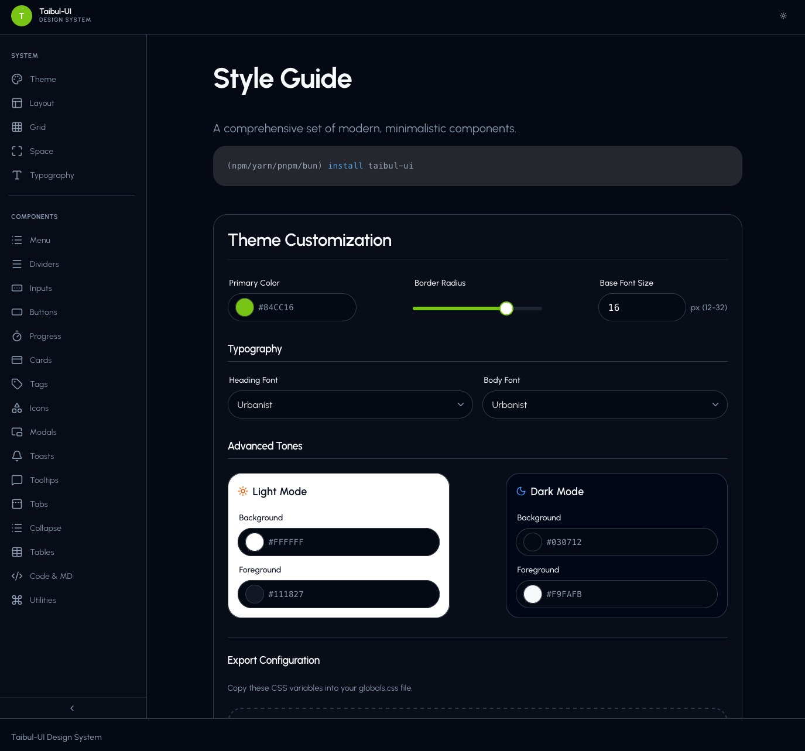

# taibul-ui

A modern, simple design system and UI library.



## Getting Started

### Installation

```bash
(npm|yarn|pnpm|bun) install taibul-ui
```

### Development

Start the local dev server:

```bash
bun dev
```

Build for production:

```bash
bun run build
```

Preview build:

```bash
bun run preview
```

## Structure

- `/src` - Core components, styles, and logic
- `/public` - Static assets

## Deployment

To deploy the example style guide to Vercel:

1. Connect your repository to Vercel.
2. In the "Build & Development Settings", override the settings with:
   - **Build Command**: `npm run build:example`
   - **Output Directory**: `dist-example`
3. Deploy!
